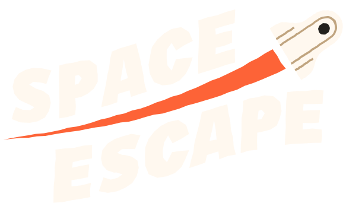
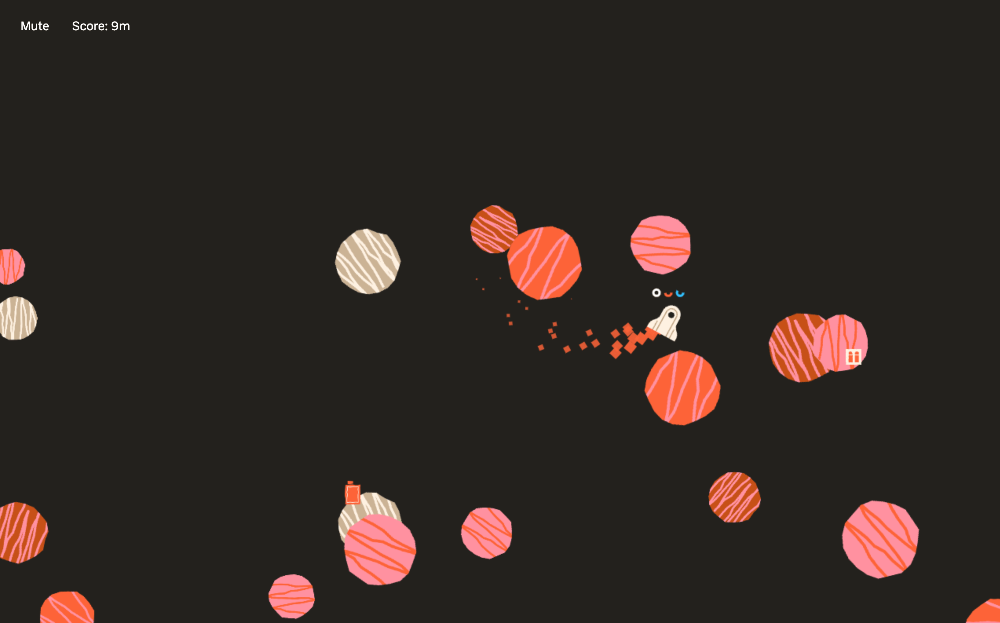

# Space Escape :rocket:
A game inspired by the game astroids. The main objective is to get as far into space a possible without being hit by astroids or running out of fuel.

[Play Game](https://rachouan.github.io/spacescape.github.io/)

## Game Controls 🕹
1. For single player player one uses ↑(FORWARD) ↓ (BACKWARDS) ← (TURN LEFT) → (TURN RIGHT) RIGHT CMD (SHOOT).
2. For multi-player player one uses the same keys as described above, for player number 2 they will use W(FORWARD) S (BACKWARDS) A (TURN LEFT) D (TURN RIGHT) LEFT CMD (SHOOT)

## Behind The Game 📖
As a designer I always enjoy games that have nice colours, and what better place then space! Think about the 80's and 90's Space shows. They're always very colourful and bright. This is an homage to that era and during those times games like space invaders were very popular.

## Used technologies 💿
- [Firebase](https://firebase.com) To store Highscores.
- [Howler](https://howlerjs.com/) To play sound pools.

## Final words 📝
This was defenitely a fun project on, started out with the barebones. Just circles and trying to get the game to function. Then after a couple of days it started to look more like a polished game. Over these few weeks I've learned a lot about collision detection and particle systems. 

## FOLLOW ME ON 👍
[Dribber](https://dribbble.com/rachouan)  [Instagram](https://instagram.com/rachouan)  [LinkedIn](https://www.linkedin.com/in/rachouan/)